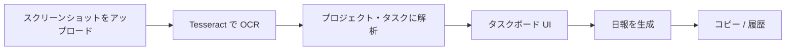
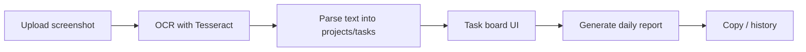

(日本語）ー ****** English Version is below.

# Daily Report AI Board

Slack の日報スクリーンショットを、編集可能なタスクボードと整形済みの日報テキストに変換する Chrome 拡張機能です。OCR は Tesseract.js でブラウザ内のみで実行されるため、API キーは不要です。

## 機能

- **スクリーンショットのアップロード** — Slack 日報の PNG / JPEG をドロップまたは選択
- **OCR（日本語・英語）** — Tesseract.js による端末内テキスト抽出
- **スマート解析** — 行をプロジェクトとタスクにグループ化。ステータス（完了 / 進行中 / 未着手 / ブロック中）を検出し、挨拶文などのノイズを除去
- **タスクボード** — タスクの編集、ワンクリックでステータス切り替え、進捗表示、Markdown としてコピー
- **日報ジェネレーター** — `お疲れ様です。` / `本日の作業` 形式のテキストを生成し、Slack へそのまま貼り付け可能
- **履歴** — 生成した日報を記録。日 / 週 / 月の完了率を表示（`chrome.storage` にローカル保存）

## 使い方



1. 拡張機能のポップアップを開き、スクリーンショットをアップロードする
2. **テキスト抽出** で OCR を実行する（初回は tessdata から言語データをダウンロード）
3. 抽出テキストを確認し、**解析** でボードを作成する
4. ボード上でタスクを調整し、**日報を生成** で整形テキストを得る
5. ヘッダーの **📊** ボタンから履歴と完了率の推移を確認する

## 動作環境

- [Node.js](https://nodejs.org/) 18 以上（ビルド用）
- Google Chrome または Chromium 系ブラウザ

## 開発

```bash
# 依存関係のインストール
npm install

# Tesseract の worker / WASM をコピーし、拡張機能を watch ビルド
npm run dev
```

`npm run dev` 実行後、[拡張機能の読み込み](#拡張機能の読み込み) の手順で `dist/` フォルダを読み込む。ファイル変更時に自動で再ビルドされます。

その他のスクリプト:

| コマンド | 説明 |
|---------|------|
| `npm run build` | 本番ビルド（出力先: `dist/`） |
| `npm run typecheck` | 型チェックのみ（出力なし） |
| `npm run prebuild` | Tesseract アセットを `public/` にコピー（`build` の前に実行） |

## 拡張機能の読み込み

1. `npm run build`（開発時は `npm run dev`）を実行する
2. Chrome を開く → **拡張機能** → **デベロッパーモード** をオンにする
3. **パッケージ化されていない拡張機能を読み込む** をクリックし、`dist/` ディレクトリを選択する

ツールバーのアイコンからポップアップが開きます。

## プロジェクト構成

```
src/
  components/     # UI（アップロード、プレビュー、ボード、出力、履歴）
  hooks/          # レポート・OCR・設定・履歴の状態管理
  parser/         # reportParser.ts, reportGenerator.ts
  services/       # ocrService.ts（Tesseract）
  storage/        # chrome.storage のラッパー
  background/     # MV3 サービスワーカー
scripts/
  copy-tesseract.mjs   # 拡張機能用に Tesseract worker + WASM をバンドル
```

## 技術スタック

- **React 18** + **TypeScript**
- **Vite** + [@crxjs/vite-plugin](https://crxjs.dev/vite-plugin)（Manifest V3）
- **tesseract.js** — 日本語（`jpn`）・英語（`eng`）OCR
- **chrome.storage** — 現在のレポートと履歴の永続化

## 権限

`manifest.json` より:

- `storage` — レポート状態と履歴をローカルに保存
- `https://tessdata.projectnaptha.com/*` — 初回利用時に OCR 言語の traineddata をダウンロード

## プライバシー

- スクリーンショットと解析データは端末内（`chrome.storage.local`）にのみ保存されます
- OCR 言語ファイルは必要時に Project Naptha の tessdata CDN から取得されますが、画像認識処理自体は拡張機能内でローカル実行されます

## ライセンス

プライベートプロジェクト（`package.json`: `"private": true`）。配布する場合はライセンスファイルを追加してください。

---------------------

# Daily Report AI Board

A Chrome extension that turns Slack daily-report screenshots into an editable task board and formatted daily report text. OCR runs entirely in the browser with Tesseract.js—no API key required.

## Features

- **Screenshot upload** — Drop or select a PNG/JPEG of a Slack daily report
- **OCR (Japanese + English)** — On-device text extraction via Tesseract.js
- **Smart parsing** — Groups lines into projects and tasks; detects status (完了 / 進行中 / 未着手 / ブロック中); filters greetings and boilerplate
- **Task board** — Edit tasks, cycle status with one click, view progress, copy as Markdown
- **Report generator** — Produces a clean `お疲れ様です。` / `本日の作業` block ready to paste back into Slack
- **History** — Tracks generated reports with day / week / month completion stats (stored locally in `chrome.storage`)

## How it works



1. Open the extension popup and upload a screenshot.
2. Run **テキスト抽出** to OCR the image (first run downloads language data from tessdata).
3. Review extracted text, then **解析** to build the board.
4. Adjust tasks on the board, then **日報を生成** to get formatted output.
5. Use the **📊** button in the header to view history and completion trends.

## Requirements

- [Node.js](https://nodejs.org/) 18+ (for building)
- Google Chrome or Chromium-based browser

## Development

```bash
# Install dependencies
npm install

# Copy Tesseract worker/WASM assets and watch-build the extension
npm run dev
```

After `npm run dev`, load the unpacked extension from the `dist/` folder (see [Load the extension](#load-the-extension) below). Rebuilds happen automatically on file changes.

Other scripts:

| Command | Description |
|---------|-------------|
| `npm run build` | Production build to `dist/` |
| `npm run typecheck` | TypeScript check without emit |
| `npm run prebuild` | Copies Tesseract assets into `public/` (runs before `build`) |

## Load the extension

1. Run `npm run build` (or `npm run dev` for development).
2. Open Chrome → **Extensions** → enable **Developer mode**.
3. Click **Load unpacked** and select the `dist/` directory.

The popup opens from the toolbar icon.

## Project structure

```
src/
  components/     # UI (upload, preview, board, output, history)
  hooks/          # Report, OCR, settings, history state
  parser/         # reportParser.ts, reportGenerator.ts
  services/       # ocrService.ts (Tesseract)
  storage/        # chrome.storage wrappers
  background/     # MV3 service worker
scripts/
  copy-tesseract.mjs   # Bundles Tesseract worker + WASM for the extension
```

## Tech stack

- **React 18** + **TypeScript**
- **Vite** with [@crxjs/vite-plugin](https://crxjs.dev/vite-plugin) (Manifest V3)
- **tesseract.js** — Japanese (`jpn`) and English (`eng`) OCR
- **chrome.storage** — Persist current report and history

## Permissions

From `manifest.json`:

- `storage` — Save report state and history locally
- `https://tessdata.projectnaptha.com/*` — Download OCR language traineddata on first use

## Privacy

- Screenshots and parsed data stay on your device (`chrome.storage.local`).
- OCR language files are fetched from Project Naptha’s tessdata CDN when needed; image recognition itself runs locally in the extension.

## License

Private project (`package.json`: `"private": true`). Add a license file if you plan to distribute.


  Project Specs — Daily Report AI Board
  
  ---
  AI / Libraries

  ┌──────────────────────────┬────────────────────────────────┬─────────────────────────────────────────────────────────────────────────────────────┐
  │           Name           │              Type              │                                      Used For                                       │
  ├──────────────────────────┼────────────────────────────────┼─────────────────────────────────────────────────────────────────────────────────────┤
  │ Tesseract.js v7          │ Local OCR engine (open-source) │ Reads text from screenshot images — recognizes both Japanese and English characters │
  ├──────────────────────────┼────────────────────────────────┼─────────────────────────────────────────────────────────────────────────────────────┤
  │ Custom rule-based parser │ Self-written logic (no AI)     │ Breaks down the OCR output into project names, tasks, and statuses                  │
  └──────────────────────────┴────────────────────────────────┴─────────────────────────────────────────────────────────────────────────────────────┘

  ▎ No external AI API is used (no OpenAI / Claude / Gemini / etc.)
  ▎ All processing runs entirely inside the browser — free, offline, and no data is sent anywhere.

  ---
  Languages & Tech Stack
  
  ┌────────────────────────────┬────────────────────────────────────────────────────────────────────────────────┐
  │   Language / Technology    │                                    Used For                                    │
  ├────────────────────────────┼────────────────────────────────────────────────────────────────────────────────┤
  │ TypeScript                 │ All source code — components, logic, and type definitions                      │
  ├────────────────────────────┼────────────────────────────────────────────────────────────────────────────────┤                                                                                
  │ TSX (TypeScript + JSX)     │ Writing React UI components (layout, buttons, task board, etc.)                │
  ├────────────────────────────┼────────────────────────────────────────────────────────────────────────────────┤
  │ CSS                        │ Styling each component (layout, colors, animations)                            │
  ├────────────────────────────┼────────────────────────────────────────────────────────────────────────────────┤
  │ React 18                   │ UI framework — state management, screen transitions, component architecture    │
  ├────────────────────────────┼────────────────────────────────────────────────────────────────────────────────┤
  │ Vite 5                     │ Build tool — dev server, bundling, and optimization                            │
  ├────────────────────────────┼────────────────────────────────────────────────────────────────────────────────┤
  │ Chrome Extension API (MV3) │ chrome.storage.local for data persistence, controls the extension popup        │
  ├────────────────────────────┼────────────────────────────────────────────────────────────────────────────────┤
  │ WebAssembly (.wasm)        │ Runs the Tesseract Japanese OCR engine at near-native speed inside the browser │
  └────────────────────────────┴────────────────────────────────────────────────────────────────────────────────┘

  ---
  Data Flow

  Screenshot image
    ↓ Tesseract.js  (WASM, runs locally in browser)
  Raw OCR text (Japanese)
    ↓ Rule-based parser  (TypeScript)
  Task board  (projects + tasks + statuses)
    ↓ Report generator  (TypeScript)
  Slack-ready text  (with :done: / :wip: markers)

