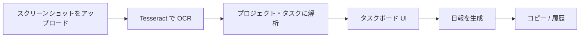

# Daily Report AI Board

Slack の日報スクリーンショットを、編集可能なタスクボードと整形済みの日報テキストに変換する Chrome 拡張機能です。OCR は Tesseract.js でブラウザ内のみで実行されるため、API キーは不要です。

## 機能

- **スクリーンショットのアップロード** — Slack 日報の PNG / JPEG をドロップまたは選択
- **OCR（日本語・英語）** — Tesseract.js による端末内テキスト抽出
- **スマート解析** — 行をプロジェクトとタスクにグループ化。ステータス（完了 / 進行中 / 未着手 / ブロック中）を検出し、挨拶文などのノイズを除去
- **タスクボード** — タスクの編集、ワンクリックでステータス切り替え、進捗表示、Markdown としてコピー
- **日報ジェネレーター** — `お疲れ様です。` / `本日の作業` 形式のテキストを生成し、Slack へそのまま貼り付け可能
- **履歴** — 生成した日報を記録。日 / 週 / 月の完了率を表示（`chrome.storage` にローカル保存）

## 使い方



1. 拡張機能のポップアップを開き、スクリーンショットをアップロードする
2. **テキスト抽出** で OCR を実行する（初回は tessdata から言語データをダウンロード）
3. 抽出テキストを確認し、**解析** でボードを作成する
4. ボード上でタスクを調整し、**日報を生成** で整形テキストを得る
5. ヘッダーの **📊** ボタンから履歴と完了率の推移を確認する

## 動作環境

- [Node.js](https://nodejs.org/) 18 以上（ビルド用）
- Google Chrome または Chromium 系ブラウザ

## 開発

```bash
# 依存関係のインストール
npm install

# Tesseract の worker / WASM をコピーし、拡張機能を watch ビルド
npm run dev
```

`npm run dev` 実行後、[拡張機能の読み込み](#拡張機能の読み込み) の手順で `dist/` フォルダを読み込む。ファイル変更時に自動で再ビルドされます。

その他のスクリプト:

| コマンド | 説明 |
|---------|------|
| `npm run build` | 本番ビルド（出力先: `dist/`） |
| `npm run typecheck` | 型チェックのみ（出力なし） |
| `npm run prebuild` | Tesseract アセットを `public/` にコピー（`build` の前に実行） |

## 拡張機能の読み込み

1. `npm run build`（開発時は `npm run dev`）を実行する
2. Chrome を開く → **拡張機能** → **デベロッパーモード** をオンにする
3. **パッケージ化されていない拡張機能を読み込む** をクリックし、`dist/` ディレクトリを選択する

ツールバーのアイコンからポップアップが開きます。

## プロジェクト構成

```
src/
  components/     # UI（アップロード、プレビュー、ボード、出力、履歴）
  hooks/          # レポート・OCR・設定・履歴の状態管理
  parser/         # reportParser.ts, reportGenerator.ts
  services/       # ocrService.ts（Tesseract）
  storage/        # chrome.storage のラッパー
  background/     # MV3 サービスワーカー
scripts/
  copy-tesseract.mjs   # 拡張機能用に Tesseract worker + WASM をバンドル
```

## 技術スタック

- **React 18** + **TypeScript**
- **Vite** + [@crxjs/vite-plugin](https://crxjs.dev/vite-plugin)（Manifest V3）
- **tesseract.js** — 日本語（`jpn`）・英語（`eng`）OCR
- **chrome.storage** — 現在のレポートと履歴の永続化

## 権限

`manifest.json` より:

- `storage` — レポート状態と履歴をローカルに保存
- `https://tessdata.projectnaptha.com/*` — 初回利用時に OCR 言語の traineddata をダウンロード

## プライバシー

- スクリーンショットと解析データは端末内（`chrome.storage.local`）にのみ保存されます
- OCR 言語ファイルは必要時に Project Naptha の tessdata CDN から取得されますが、画像認識処理自体は拡張機能内でローカル実行されます

## ライセンス

プライベートプロジェクト（`package.json`: `"private": true`）。配布する場合はライセンスファイルを追加してください。
